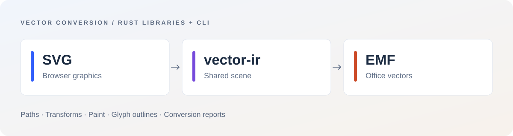

<div align="center">

# vecmeta

**连接浏览器 SVG 与 Office EMF 的 Rust 矢量转换引擎。**

[English](README.md) | **简体中文**

[官网](https://omnidoc.top/) · [快速开始](#快速开始) · [文档](#文档) · [测评](benchmarks/README.zh-CN.md)

[](https://github.com/OmniDocX/vecmeta/actions/workflows/verify.yml)
[](LICENSE)
[](https://github.com/OmniDocX/vecmeta/issues)

</div>

vecmeta 提供 SVG ↔ EMF 双向转换的 Rust 库与命令行工具。通过共享场景模型处理路径、图形、变换、画笔和文字轮廓，适合文档格式转换、矢量资源处理及办公应用集成。转换流程无需安装 Microsoft Office 或 LibreOffice。

这是 OmniDoc 自主研发的国产组件，为纯国产应用项目（app project）提供底层矢量能力。



## 核心能力

- **双向转换** — 将 SVG 图形写入 EMF，或将 EMF 绘制记录转换为浏览器可显示的 SVG。
- **Rust 库与 CLI** — 可嵌入 Rust 程序，也可通过命令行接入批处理、构建脚本和本机工具。
- **共享矢量模型** — 统一路径、坐标变换、填充、描边与受支持的渐变处理。
- **文字转轮廓** — 通过 fontdb / ttf-parser 查找字体并提取字形几何。
- **转换诊断** — 报告被跳过的内容和兼容性警告，便于调用方决定后续处理。
- **可选源数据恢复** — `--lossless` 封装原始数据，反向转换时可恢复嵌入的源文件。

## 快速开始

安装 Rust 和 Cargo（CI 使用 Rust 1.88）：

```sh
git clone https://github.com/OmniDocX/vecmeta.git
cd vecmeta
cargo build --release --locked -p emfsvg-cli

# SVG → EMF
cargo run --release --locked -p emfsvg-cli -- to-emf input.svg -o output.emf

# EMF → SVG
cargo run --release --locked -p emfsvg-cli -- to-svg input.emf -o output.svg
```

编译后的程序位于 `target/release/emfsvg`，Windows 为 `emfsvg.exe`。使用 `--help` 查看参数，文字转轮廓需安装对应字体。

## Rust 集成

在项目中以 path 或 Git 依赖引用 `svg2emf` / `emf2svg` crate，即可直接转换并读取诊断：

```rust
use svg2emf::{svg_to_emf_with_report, EmitOptions};

fn main() -> Result<(), Box<dyn std::error::Error>> {
    let svg = r#"<svg xmlns="http://www.w3.org/2000/svg" width="100" height="100">
      <circle cx="50" cy="50" r="25" fill="#315efb"/>
    </svg>"#;

    let result = svg_to_emf_with_report(svg, EmitOptions::default())?;
    std::fs::write("output.emf", &result.bytes)?;
    for warning in &result.warnings {
        eprintln!("{warning}");
    }
    Ok(())
}

```

反向转换使用 `emf_to_svg_with_report`。UniPPT 内置的是独立版本快照，集成时应以目标组件的 API 为准。

## 性能

<!-- BENCHMARK:START -->
| 操作 | 工作负载 | 中位数 |
| --- | --- | --- |
| SVG → EMF | 10,000 图元 | **105.80 ms** |
| EMF → SVG | 10,000 图元 | **57.10 ms** |
| 几何往返检查 | 10,000 图元 | **206.04 ms** |

2026-09-16 · Windows 10 · Intel i7-1165G7 · 31.7 GiB · Rust release · 预热 2 次 / 测量 7 次。

[完整测评、原始数据与复现方法](benchmarks/README.zh-CN.md) — 以上为合成工作负载的本机测试，不含浏览器渲染，未与其他办公软件做速度对测。
<!-- BENCHMARK:END -->

## 转换模式与兼容性

默认转换处理受支持的矢量语义；`--lossless` 额外嵌入源文件。源文件字节恢复与第三方软件的渲染一致性是两项能力，后者仍需实际渲染验证。

文字转轮廓后是几何对象。位图、滤镜和裁剪支持有限；径向渐变采用近似处理。调用方应读取转换警告，并在目标应用中检查重要输出。

## 文档

| 组件 | 职责 |
| --- | --- |
| [`vector-ir`](crates/vector-ir) | 场景、路径、变换与画笔 |
| [`emf-core`](crates/emf-core) | EMF 二进制读写 |
| [`svg2emf`](crates/svg2emf) / [`emf2svg`](crates/emf2svg) | 解析、转换与诊断 |
| [`glyph2path`](crates/glyph2path) | 字体查找与字形轮廓 |
| [`emfsvg-cli`](crates/emfsvg-cli) | 命令行与几何往返检查 |

[来源说明](docs/PROVENANCE.md) · [贡献指南](CONTRIBUTING.md) · [完整测评](benchmarks/README.zh-CN.md)

## OmniDoc 产品与社区

[OmniDoc 主站](https://omnidoc.top/) · [UniPPT](https://github.com/OmniDocX/UniPPT) · [UniCell](https://github.com/OmniDocX/unicell) · [vecmeta](https://github.com/OmniDocX/vecmeta)

问题与建议请提交 [GitHub Issue](https://github.com/OmniDocX/vecmeta/issues)，附上复现步骤和可公开的最小示例。欢迎参与功能开发、兼容性改进和文档建设。

办公体验对标 Microsoft 365（Office 365）与 WPS Office；公开办公项目参照 ONLYOFFICE、Univer。[项目定位与能力对照](docs/COMPARISON.zh-CN.md)。

## 许可证与商业合作

自有代码采用 [PolyForm Noncommercial 1.0.0](LICENSE)。标准许可允许的非商业及特定机构用途免费；超出允许范围的商业用途，须[申请付费商业授权](docs/COMMERCIAL_LICENSE.md)并取得书面许可。

**商业联系：[cc@omnidoc.top](mailto:cc@omnidoc.top) · 微信：13184071590**

本项目采用源码可见许可（非 OSI 开源许可）。第三方组件及旧版本有效授权保持独立，详见[许可范围](docs/LICENSING.md)。
